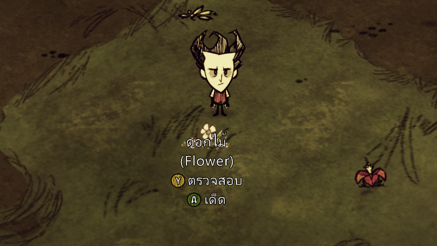

  

# นี่คืออะไร:
เปลี่ยนเกม Don't Starve Together ทั้งหมดเป็นภาษาไทย
และสามารถพิมพ์ไทยในเกมได้โดยไม่เป็นเครื่องหมาย "???"

# คำอธิบายเพิ่มเติม:
หากปิดการแปลทั้งหมดไว้จะนำฟอนต์เกมเดิมกลับมา แต่ยังพิมพ์แชทไทยได้
หลังจากนี้จะมีการอัพเดทตามแพทช์ของตัวเกมต่อไป

# เปิด/ปิดการแปลแยกส่วนได้:

  

# ไอเทมสองภาษา:
ป้องกันการสับสนชื่อไอเทมเมื่อเล่นกับผู้ที่ไม่ได้ติดตั้งส่วนเสริมภาษาไทย
รวมถึงชื่อตัวละคร หมู และอื่นๆ

  

# รองรับการแสดงผลปุ่ม Xbox Controller:

  

# ปัญหาที่อาจเกิดขึ้น:
หากพบเห็นข้อผิดพลาดเช่น การแปลผิด ส่วนเสริมมีปัญหา กรุณาแจ้งผู้พัฒนาด้วยที่[โพสปักหมุด](https://steamcommunity.com/workshop/filedetails/discussion/854549853/133257636764269523/) เพื่อจะได้ทำการแก้ไขในการอัพเดท หรือสามารถอ่านคำแนะนำสำหรับปัญหาต่างๆได้เช่นกัน
สามารถพูดคุยหรือติดต่อสอบถามและพิมพ์เป็นกำลังใจได้ที่ความคิดเห็นบน[สตรีมเวิร์คชอป](https://steamcommunity.com/sharedfiles/filedetails/?id=854549853)

  

-------

กลุ่ม [Facebook](https://www.facebook.com/groups/DONTSTARVE.THAI/)
เวอร์ชั่นสำหรับ [Don't Starve Together](https://steamcommunity.com/sharedfiles/filedetails/?id=807516498)

หากชอบใจให้**บอกต่อ**เพื่อนและกด**ถูกใจ**[เวิร์คชอป](https://steamcommunity.com/sharedfiles/filedetails/?id=854549853)ด้วย
ขอบคุณ
